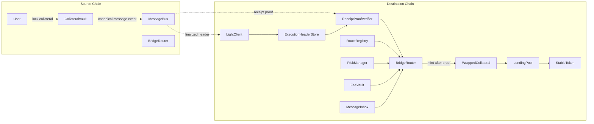

# Cross-Chain Lending

Production-oriented cross-chain lending architecture for a two-chain local demo.

Bridge correctness comes from finalized source-chain headers, on-chain light-client state, execution-header linkage, receipt/event inclusion proofs, replay protection, and route-level risk policy. Relayers are permissionless transport only.

## Core Flow

Lock -> Mint:
1. User locks native collateral in `CollateralVault` on the source chain.
2. `CollateralVault` dispatches a canonical message through `MessageBus`.
3. Any relayer submits a finalized source-chain header to the destination `LightClient`.
4. Any relayer stores the finalized execution header in `ExecutionHeaderStore`.
5. Any relayer submits the message plus receipt proof to `BridgeRouter`.
6. `BridgeRouter` verifies the route, proof, replay state, and risk policy, then mints `WrappedCollateral`.
7. User deposits wrapped collateral into `LendingPool` and borrows `StableToken`.

Burn -> Unlock:
1. User repays debt, withdraws wrapped collateral, and calls `BridgeRouter.requestBurn`.
2. `BridgeRouter` burns wrapped collateral and dispatches a release message through local `MessageBus`.
3. The opposite chain verifies finalized header, execution header, and receipt proof.
4. `BridgeRouter` consumes the message and unlocks native collateral from `CollateralVault`.

Relayers are permissionless. They move headers and proofs; they are not trusted for correctness.

## Architecture



## Contracts

- `contracts/bridge/MessageBus.sol`: canonical source-chain event emitter with deterministic message IDs.
- `contracts/lightclient/LightClient.sol`: stores finalized source-chain checkpoints accepted by a pluggable verifier.
- `contracts/lightclient/ExecutionHeaderStore.sol`: stores finalized execution headers and receipt roots.
- `contracts/lightclient/ReceiptProofVerifier.sol`: verifies event inclusion against stored execution headers. The repo uses a strict dev verifier for local tests.
- `contracts/bridge/MessageInbox.sol`: consumes message IDs and blocks replay.
- `contracts/bridge/BridgeRouter.sol`: verifies proof flow and performs mint/unlock. Also burns wrapped collateral for release messages.
- `contracts/risk/RouteRegistry.sol`: route config for source/destination chains, canonical emitter, expected source adapter, assets, fees, caps, rate limits, and high-value thresholds.
- `contracts/risk/RiskManager.sol`: secondary controls for route pause, cursed route, transfer caps, rate windows, and high-value approval.
- `contracts/fees/FeeVault.sol`: route fee collection and optional relayer rewards.
- `contracts/CollateralVault.sol`: source adapter that locks collateral and dispatches `MessageBus` messages.
- `contracts/WrappedCollateral.sol`: mint/burn token controlled by `BridgeRouter`.
- `contracts/LendingPool.sol`: lending market logic preserved from the thesis prototype.

## Local Run

```bash
npm install
npm run compile
npm run node:chainA
npm run node:chainB
npm run deploy:multichain
npm run seed:multichain
npm run worker:hub
```

Serve the demo:

```bash
cd demo
python -m http.server 5500
```

Open:
- `http://localhost:5500/user.html`
- `http://localhost:5500/owner.html`

Worker scripts:
- `scripts/header-relayer.mjs`: submits finalized header updates and execution headers.
- `scripts/proof-relayer.mjs`: submits receipt proofs and messages to `BridgeRouter`.
- `scripts/risk-watcher.mjs`: monitors route policy and can pause/curse configured routes.

## Deployment Output

`scripts/deploy-multichain.mjs` writes `demo/multichain-addresses.json` with:
- chain-level `messageBus`, `lightClient`, `executionHeaderStore`, `receiptProofVerifier`, `messageInbox`, `bridgeRouter`, `routeRegistry`, `riskManager`, `feeVault`
- market-level lock and burn route IDs
- lending pool, token, vault, oracle, and swap router addresses
- relayer addresses for demo convenience only

## Tests

Run:

```bash
TMPDIR=/tmp XDG_CACHE_HOME=/tmp/hardhat-cache npm run test:solidity
```

The bridge test suite covers:
1. lock -> mint only after finalized header and proof path
2. burn -> unlock only after finalized header and proof path
3. replay attack rejection
4. invalid proof rejection
5. wrong route rejection
6. wrong source emitter rejection
7. wrong source adapter rejection
8. paused route rejection
9. rate-limit rejection
10. high-value secondary approval
11. arbitrary relayer submission

## Current Bridge Surface

The repo contains only the proof-based bridge surface:
- deterministic canonical messages
- finalized header updates
- execution-header storage
- receipt inclusion proof verification
- message inbox replay protection
- route-scoped policy and risk controls
- permissionless relayers

## Production Readiness Gaps

This repo is architecturally proof-based, but it is still a local demo:
- `DevHeaderUpdateVerifier` and dev receipt proofs must be replaced with real chain-specific consensus and receipt proof verifiers.
- Execution ancestry from consensus checkpoints to execution payloads is simplified to finalized execution blocks in local mode.
- No production oracle aggregation, sequencer/finality-delay policy, or reorg monitoring.
- No governance timelock or multi-sig administration for route and risk updates.
- No full fee market, relayer reimbursement strategy, or slashing mechanism.
- No audited MPT/SNARK proof verifier implementation.
- No mainnet-grade monitoring, incident response, or formal verification.
